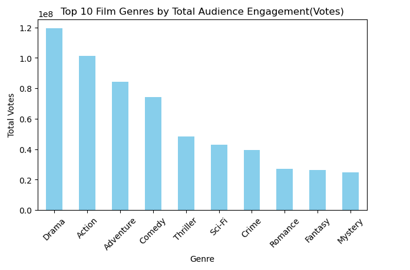
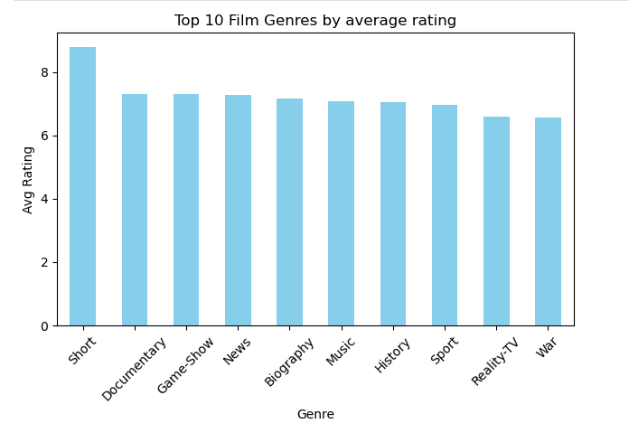
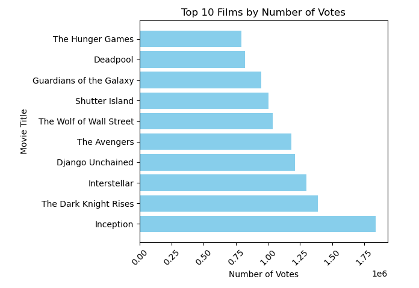

## Phase-2 final project
## Overview
In this project, we will use exploratory data analysis to generate insight for a business stackholder. 

## Business Understanding
After seing all the big company creating original video content and the want ti get in on the fun. A company has decided to create a new movie studio, but the personal doesn't know anything about creating movies. So we are going to exploring what types of films are currently doing the best at the box office. we will translate those findings into actionable insights that the head of the company's new movie studio can use to help decide what type of films to create.

## Data Understanding and Analysis
* We have data from various locations, the different files have different formats. Some are compressed CSV(comma-separated values) or TSV(tab-separated values) files that can be opened using spreadsheet software or `pd.read_csv`, whith the data from IMDB is located in a SQLite database. In this case all those data are zippep in a folder that called `zippedData`, we will use `file explorer` to unzip them. Right now those files are ready to use.

    The goal of this analysis is to identify what types of films are currently doing the best at the box office to help the company's new movie studio about their decisions to create movie.

* In `zippedData` we are going to use `im.db` file. This is a sqlite database file. This database has 8 tables: movies_basics, directors, known_for, movies_akas, movies_rating, persons, principals, writers.
* The tables that have relevant data to make this analysis possible is: **movie_basics** and **movie_rating**.

  - **movie_basics:** has data about title, runtime, genres, etc...
  - **movie_rating**: has data about average rating and number of votes
    
* So let's see which genres get the most audience engagement(number of votes)?
* What genres get the most appreciation (more rating)?
* What is the best types accordingly both parameters, audience and liked?

### Visualization

  
## Conclusion
After analyzing both audience engagement (number of votes) and audience appreciation (average rating), we find that the films performing best at the box office typically fall into a few key genre categories. **Drama, Action, Adventure, Comedy and Thriller genres** consistently receive the highest number of votes, indicating mass appeal and strong box office potential. At the same time, genres like **Documentary, short, Game-show and well-executed hybrid genres** tend to earn higher average ratings, reflecting deeper viewer satisfaction and long-term value.

Therefore, films that combine high-energy storytelling with emotional or intellectual depth (such as Action-Drama or Sci-Fi-Thriller) are especially well-positioned to succeed both commercially and critically. Studios should strategically balance blockbuster appeal with strong narratives, and explore rising hybrid genres to capture evolving audience tastes in a competitive market.
